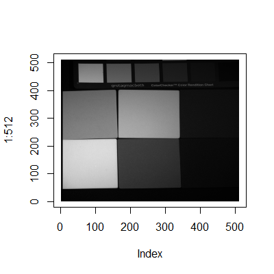
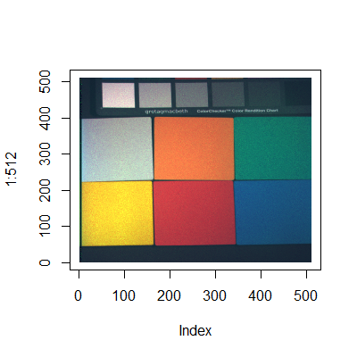
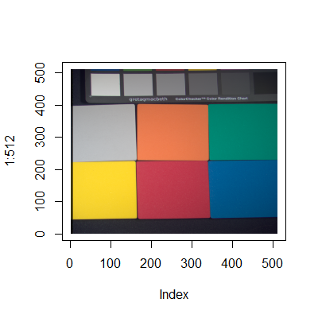

## Contents 

This document contains a description of the assignment solution, which generates the given target image by combining 31 multispectral images.

The repository also contains the relevant R code ([assignment_code.R](assignment%20code.R)) and a folder with the input images ([Data/](Data)).


## Description of solution

### 1. The data

The input data consists of 31 grayscale images with dimensions [512,512,1] (or [512,512,3] where RGB have equal values). The first two dimensions are x,y-coordinates of the pixel and the third is color intensity. The target image is of size [512,512,3], where the third dimension contains RGB values.

Target image:


Each input image has a known wavelength between 400 and 700 nm, which is converted to a [1,3] vector of RGB values via an algorithm from <https://stackoverflow.com/questions/3407942/rgb-values-of-visible-spectrum>. In this assignment we use RGB values between 0-1 for computational purposes. They can be transformed into 0-255 range by simply multiplying by 255.

```{r results='hide', message=FALSE, warning=FALSE}
require(png)
require(bmp)
require(reshape)
require(dplyr)
require(tidyverse)

# input image wavelengths
colors <- seq(400,700,10) 

# wavelength to RGB [0,1] conversion function from https://stackoverflow.com/questions/3407942/rgb-values-of-visible-spectrum
spectral_color <- function(l) {
  r=0;   g=0;   b=0
  if ((l>=400.0)&(l<410.0)) { t=(l-400.0)/(410.0-400.0); r=    +(0.33*t)-(0.20*t*t) }
  else if ((l>=410.0)&(l<475.0)) { t=(l-410.0)/(475.0-410.0); r=0.14         -(0.13*t*t) }
  else if ((l>=545.0)&(l<595.0)) { t=(l-545.0)/(595.0-545.0); r=    +(1.98*t)-(     t*t) }
  else if ((l>=595.0)&(l<650.0)) { t=(l-595.0)/(650.0-595.0); r=0.98+(0.06*t)-(0.40*t*t); }
  else if ((l>=650.0)&(l<700.0)) { t=(l-650.0)/(700.0-650.0); r=0.65-(0.84*t)+(0.20*t*t); }
  if ((l>=415.0)&(l<475.0)) { t=(l-415.0)/(475.0-415.0); g=             +(0.80*t*t); }
  else if ((l>=475.0)&(l<590.0)) { t=(l-475.0)/(590.0-475.0); g=0.8 +(0.76*t)-(0.80*t*t); }
  else if ((l>=585.0)&(l<639.0)) { t=(l-585.0)/(639.0-585.0); g=0.84-(0.84*t)           ; }
  if ((l>=400.0)&(l<475.0)) { t=(l-400.0)/(475.0-400.0); b=    +(2.20*t)-(1.50*t*t); }
  else if ((l>=475.0)&(l<560.0)) { t=(l-475.0)/(560.0-475.0); b=0.7 -(     t)+(0.30*t*t); }
  
  return(c(r,g,b))
}
```


### 2. Transformations 

Since we will be treating each image as a feature in the input data and the target image as a single target variable, we need to transform the inputs and target image into compatible shapes. 

First, we load each input image as a [512,512,1] array and melt it into a [262144,1] column, where each row represents a pixel and each pixel has color intensity with values between 0-1. Then, to color the image according to its wavelength, we multiply the column by the corresponding [1,3] RGB vector, ending up with a [262144,3] dataframe.  

For example, image 20 had wavelength 590, which is represented by RGB values R=0.972, G=0.762, B=0.000 (or R=248, G=194, B=0 on 0-255 scale). Multiplying its intensity with each color, we eliminate blue from the image, decrease the red and green, and are left with a yellowish hue. 

```{r}
# ID dataframe to transform image data into long format
input <- merge(seq(1:512), seq(1:512)) %>% merge(.,c('R','G','B'),by = NULL)
colnames(input) <- c('x','y','RGB')

# load input images
path <- "~\\assignment\\Data\\"

for (i in 1:31) {
  # read image colors between [0,1], transform into long format for matrix multiplication
  img <- readPNG(paste0(path, "multispectral_images\\sponges_ms_", ifelse(i<10,0,""),i, ".png"))
  img1 <- as.matrix(melt(img))
  
  # get RGB values for image wavelength
  rgb <-  t(as.matrix(spectral_color(colors[i]))) 
  
  # multiply each pixel color with RGB vector (best guess, but seems to work)
  rgbimg <- data.frame(img1[,1:2],img1[,3] %*% rgb) %>% melt(., id=c("X1","X2"))
 
  # add each image data as new column in data frame
  input[[paste0("img_",i)]] <- rgbimg[,4]
}
```

Image 20, original and reconstructed after colouring:

 

In order to get a single feature from each image, we now melt each [262144,3] dataframe into a [786432,1] column and append all resulting columns horizontally. This leaves us with an input dataframe of size [786432,31], not including pixel coordinates and the R/G/B factor. The target image is also melted from [512,512,3] into [786432,1].

```{r results=FALSE}
# get target image in RGB
target <- read.bmp(paste0(path,"sponges_RGB.bmp")) #returns y,x,RGB
tarimg <- as.raster(target, max = 255)

# put target into long format, standardize 0-255 RGB values into 0-1 to make it compatible with input images
target1 <- melt(target) 
target <- target1$value/255

#input data, remove location indices, first and last images since those have RGB=0
df <- input %>% select(-x, -y, -img_1, -img_31) 
```

Now we need to find a combination of the input features that is close to the target variable.


### 3. Models

#### 3.1 Linear regression

As the target feature is a continuous variable, it is reasonable to try linear regression first to set a baseline. 

```{r}
model1 <- lm(target ~ ., df)
summary(model1) 
```

R2=0.9597, which is not bad, all the variables are statistically significant as well.
We predict new labels based on the model and replace values outside of 0-1 range with 0 or 1 as needed.

```{r results='hide', message=FALSE, warning=FALSE, fig.show='hide'}
# predict target image based on input, turn negatives into 0 and 1+ values into 1
pred <- predict(model1, df) %>% replace(., .<0, 0) %>% replace(., .>1, 1) 

# make a 3D array for rastering
dim(pred) <- c(512,512,3)
plot(1:512, type='n')
rasterImage(pred,1,1,512,512)     # prediction (linear regression)
rasterImage(tarimg ,1,1,512,512)  # actual

```
Predicted image (left) and actual target (right):

 

It is a reasonable result, but we can do better.


#### 3.2 CatBoost

[CatBoost](https://catboost.ai/) is a gradient boosting library from the people who brought us Yandex. It is not available on CRAN, but it can easily be installed directly from source. 

```{r results='hide', message=FALSE, warning=FALSE}
# install.packages('devtools')
# devtools::install_url('https://github.com/catboost/catboost/releases/download/v0.22/catboost-R-Windows-0.22.tgz', INSTALL_opts = c("--no-multiarch"))
library(catboost)
```
For CatBoost, we need to create pools, which are objects that hold input data. We use a simple model with RMSE loss function, 200 iterations and R2 output to make it comparable to linear regression output.


```{r warning=FALSE,  fig.show='hide'}
# create pools for training and prediction
train_pool <- catboost.load_pool(data = df, cat_features=1, label = target)
real_pool <-  catboost.load_pool(data = df, cat_features=1, label = NULL)

# train model, takes about 1 minute on laptop
model2 <- catboost.train(train_pool,  NULL,
                        params = list(loss_function = 'RMSE', iterations = 200, 
                        metric_period=10, random_seed=0, eval_metric='R2'))

# predict target image based on input, turn negatives into 0 and 1+ values into 1
pred2 <- catboost.predict(model2, real_pool)
pred2 <- pred2 %>% replace(., .<0, 0) %>% replace(., .>1, 1) 

# make a 3D array for rastering
dim(pred2) <- c(512,512,3)
plot(1:512, type='n')
rasterImage(pred2,1,1,512,512)    # prediction (CatBoost)
rasterImage(tarimg ,1,1,512,512)  # actual
```
R2=0.9997, which is a much better result. Comparing the predicted image and the target visually, it is almost impossible to notice any differences.
Predicted image (left) and actual target (right):

 


